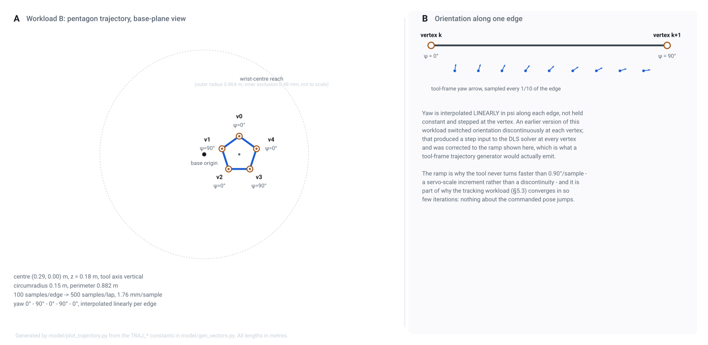

# Latency Determinism of Closed-Form and Iterative Inverse Kinematics on a Zynq-7000 SoC

A learning exercise in hardware acceleration: two inverse-kinematics (IK)
solvers for a 6-DOF manipulator, synthesised as Vitis HLS IP for the
programmable logic of a Xilinx Zynq-7000 (xc7z020clg400-1, PYNQ-Z1/Z2) and
invoked from its Cortex-A9. The question asked is not which solver is faster
on average, but which one has a *bounded* worst case — the property a
real-time control loop actually depends on.

## Abstract

A closed-form solver and a damped-least-squares (DLS) iterative solver are
synthesised from the same source tree, in the same fixed-point format
(Q16.16), on the same device, and timed with the same instrument (PS
wall-clock around the full AXI4-Lite transaction). The closed-form solver's
latency is a compile-time constant (max/median = 1.00). The DLS solver's
latency is a function of iteration count: 3–22 iterations and a max/median
of 5.47 over a disturbed 48-pose workload, collapsing to a flat 2 iterations
throughout a warm-started, servo-rate trajectory. Per-iteration cost is a
reproducible hardware constant, `423 ns + 17260 ns × iterations`, fit on one
run and predicting a second to within 0.17% — the observed spread is
iteration count, not data dependence inside an iteration.

**The FPGA's contribution here is determinism, not throughput.** Against the
same algorithm run in double precision on the Cortex-A9, the PL is only
~1.5× faster: DLS spends its time in a loop whose body is one FK+Jacobian
pass, and at this problem size (6 DOF, 6×6 linear systems) there is limited
parallelism to exploit. What the hardware buys is a solver whose worst case
is knowable and can be capped (§5), not one that completes faster in the
typical case.

---

## 1. Two solver families

| | analytic | DLS |
|---|---|---|
| method | closed form, wrist decoupling | `q ← q + Jᵀ(JJᵀ + λ²I)⁻¹e` |
| latency | fixed, compile-time | data-dependent iteration count |
| failure mode | `IK_ERR_UNREACH` | exhausts iteration budget |
| generality | this kinematic structure only | arbitrary differentiable kinematics |

The closed-form solver exists only because this arm has a spherical wrist
(position/orientation decoupling); DLS applies to any manipulator and
degrades gracefully near singularities. The comparison is deliberately
narrow: same silicon, same arithmetic, same instrument, so any difference in
latency distribution is attributable to solver structure alone.

---

## 2. Manipulator

A PUMA 560 — 6R, spherical wrist, standard Denavit–Hartenberg parameters
(Corke's `mdl_puma560`, equivalent to Craig §3.6):

| i | aᵢ (m) | αᵢ | dᵢ (m) | qᵢ limits |
|---|---|---|---|---|
| 1 | 0 | +π/2 | 0.6718 | −160°…+160° |
| 2 | 0.4318 | 0 | 0 | −225°…+45° |
| 3 | 0.0203 | −π/2 | 0.15005 | −45°…+225° |
| 4 | 0 | +π/2 | 0.4318 | −110°…+170° |
| 5 | 0 | −π/2 | 0 | −100°…+100° |
| 6 | 0 | 0 | 0.0565 | −266°…+266° |

<picture>
  <source media="(prefers-color-scheme: dark)" srcset="docs/figures/dh_frames_dark.svg">
  
</picture>

**Figure 1.** Frame assignment and link dimensions, generated directly from
`model/robot.py`'s DH table via `model/plot_dh.py` — the figure cannot
disagree with the kinematics the solvers are built from.

`model/robot.py` is the single declarative source (DH table, joint limits,
provenance); everything downstream — the reference model, vector generation,
Figure 1, and the generated HLS header — reads from it. **WIP:**
`model/urdf_to_dh.py` already converts an arbitrary URDF into this same
representation, so the pipeline is not intrinsically tied to the PUMA 560;
generalising the solvers and workloads to an arbitrary robot description is
the open direction.

---

## 3. Workload

<picture>
  <source media="(prefers-color-scheme: dark)" srcset="docs/figures/trajectory_dark.svg">
  
</picture>

**Figure 2.** A pentagon path traversed at fixed sample spacing, used purely
as a warm-started tracking exercise for the DLS kernel — illustrative, not a
validated operational trajectory.

Two workloads exercise both kernels: 48 independent poses selected to
include the reference model's slow-converging tail (the *disturbed* case),
and the Figure 2 trajectory, solved with each sample warm-started from the
previous one (the *tracking* case). The two answer different questions: the
first characterises what a scheduler must survive, the second what the
machine does the rest of the time.

---

## 4. Numeric format

All quantities crossing the AXI4-Lite interface are Q16.16
(`ik_real_t = ap_fixed<32,16>`). The format was chosen by measurement, not
convention: `model/validate.py` sweeps Q16.16 through Q16.32 and finds
convergence bounded by the DLS damping factor rather than word length, so
the narrowest adequate format was kept. A separate `-DIK_USE_FLOAT` build
compiles the identical kernel algorithms in double precision, which is how
quantisation error is attributed separately from algorithmic error.

---

## 5. Results

### 5.1 Latency distribution

| kernel | workload | min | median | max | max/med |
|---|---|---|---|---|---|
| analytic (PL) | 48 poses | 10716 ns | 10744 ns | 10781 ns | **1.00** |
| DLS (PL) | 48 poses, disturbed | 52144 ns | 69378 ns | 380086 ns | **5.47** |
| DLS (PL) | trajectory, tracking | 34913 ns | 35003 ns | 35092 ns | **1.00** |

The trajectory row predates a pentagon re-siting (self-collision and a joint-limit
violation found and fixed in `model/gen_vectors.py`); the fixed-latency finding
is expected to hold, the exact numbers are not yet re-confirmed (STATUS.md).

The analytic kernel's latency is a hardware constant. The DLS kernel's
latency is wide when disturbed and collapses to fixed-latency while tracking
at a servo-realistic sample spacing — a property of the *sampling rate*, not
of the solver alone; ten times coarser sampling reopens the spread to
2–3 iterations.

### 5.2 Per-iteration cost is a hardware constant

```
latency_ns = 423 + 17260 × iterations
```

Fit on one hardware run, this relation predicts a second run's five-number
summary (2 to 22 iterations) to within 0.17% without refitting. All observed
latency variance is iteration count; nothing inside a DLS iteration is
data-dependent.

### 5.3 Throughput vs. the Cortex-A9

| | PL / PS(double) speed-up |
|---|---|
| analytic | ~3.0× |
| DLS | ~1.5× |

The PL runs the DLS inner loop at 80 MHz against the A9's 667 MHz; the
advantage comes from parallelism within one FK+Jacobian pass, and at this
problem size (6×6 systems) that advantage is modest. **This is the central
finding of the exercise: the case for the PL implementation rests on
determinism, not on raw throughput.**

---

## 6. What this buys, and what it doesn't

**Good.** A worst case that is a property of the hardware and can be
*quoted* — verified reproducible across runs, decomposed into a closed-form
per-iteration cost, and made schedulable by capping `max_iter` (a runtime
register: capping at 2 iterations pins the whole tracking workload at a hard
35 µs, at zero engineering cost, degrading only when the loop is disturbed).

**Not good.** Throughput parity with a general-purpose core at this problem
size — the FPGA is not "faster IK," it is "IK with a bound on how slow it
gets." The disturbed-case worst case is *bounded*, not *eliminated*: a step
clamp (trust region) shrinks it but does not remove data dependence, and the
closed-form solver that has none exists only for kinematically fortunate
arms.

---

## 7. Reproduction

Prerequisites: Vivado and Vitis 2025.2, Python 3 with numpy.

```bash
# reference model, vectors, generated headers/figures
python3 model/validate.py
python3 model/gen_geometry.py
python3 model/gen_vectors.py
python3 model/plot_dh.py
python3 model/plot_trajectory.py

# host regression (no Vitis needed)
make -C hls host

# HLS: simulate, synthesise, package
make -C hls csim && make -C hls syn && make -C hls reports && make -C hls ip

# hardware — one IK kernel at a time (both together exceed the device's DSP budget)
vivado -mode batch -source scripts/build_vivado.tcl -tclargs --kernels ik_dls_kernel

# register map, then the application
python3 scripts/gen_regmap.py
vitis -s scripts/build_vitis.py
```

## 8. Further documentation

- [STATUS.md](STATUS.md) — current build/measurement status and open items.
- [docs/technical_manual.md](docs/technical_manual.md) — full derivation of
  the kinematics, both solvers, and the fixed-point format.
- [docs/timing_methodology.md](docs/timing_methodology.md) — why PS
  wall-clock, not HLS-reported cycle latency, is measured here.
