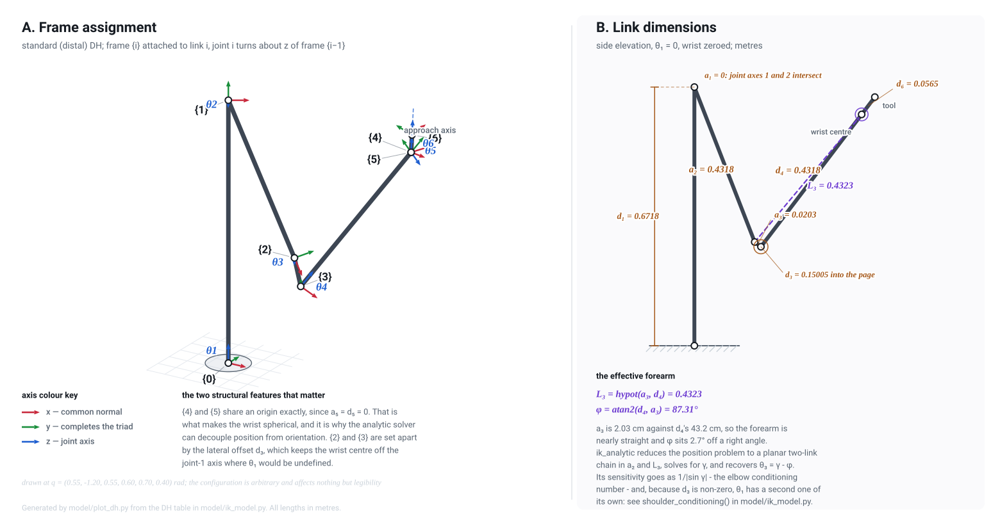

# Latency Determinism of Closed-Form and Iterative Inverse Kinematics on a Zynq-7000 SoC

An experimental comparison of two inverse-kinematics (IK) solvers for a 6-DOF
anthropomorphic manipulator, implemented as Vitis HLS IP for the programmable
logic of a Xilinx Zynq-7000 (xc7z020clg400-1, PYNQ-Z1/Z2) and invoked from the
Cortex-A9 processing system.

## Abstract

Closed-form and iterative IK solvers are ordinarily compared on accuracy,
generality, and mean execution time. This work holds accuracy and arithmetic
fixed and compares them on a property that matters for their use inside a
real-time control loop: whether execution time is a constant of the
implementation or a function of the input. Both solvers are synthesised from
the same source tree, in the same fixed-point format (Q16.16), and measured on
the same device with the same instrument, so that any difference in latency
distribution is attributable to solver structure rather than to arithmetic,
target, or measurement method.

Two workloads are used. The first comprises 48 independent target poses,
deliberately including geometrically ill-conditioned configurations and a tail
selected on the reference model's iteration count; it characterises the
disturbed case. The second is a 500-sample pentagon trajectory, sampled at
2.35 mm of tool travel per step, in which the damped-least-squares (DLS) solver
is warm-started from its own previous output as a servo loop would drive it; it
characterises the tracking case.

On hardware, the DLS kernel exhibits a ratio of maximum to median latency of
5.47 over the 48-pose set and 1.00 over the trajectory, with identical
arithmetic and configuration in both cases. The disturbed case ranges over
52.1–380.1 µs and three to twenty-two iterations; the tracking case completes
in exactly two iterations at all 500 samples and ranges over 34.91–35.09 µs, a
total spread of 0.51% that is attributable to bus and instrument noise rather
than to the solver. Total latency is described across the full measured range
by `423 ns + 17260 ns × iterations`; this relation was fitted on an earlier run
and predicts every row of the present one to within 0.17% without refitting,
establishing that the observed variance is iteration count rather than any data
dependence within an iteration.

The tracking case's flatness is shown to be a function of the sampling
interval, not of the solver alone: at ten times coarser sampling the same lap
requires two or three iterations per sample and the chained fixed-point solve
diverges from the double-precision reference by up to 1922 µrad, against 183
µrad at the finer sampling — despite the finer lap performing ten times as many
solves. Divergence is therefore bounded by the convergence tolerance rather
than accumulated over the path.

**Only the DLS kernel has been re-measured on the manipulator described in
§2.1.** The analytic figures in §5.1 were taken on an earlier 0.71 m arm, in a
bitstream that predates both the trust region and the two-workload harness, and
are retained for scale rather than as a matched comparison. §5.0 states which
figures are current and which are not; [Threats to
validity](#7-threats-to-validity) states what the current ones do not support.

---

## 1. Motivation

An IK solver placed in a servo loop must satisfy a deadline on every
invocation, not on average. The two solver families differ structurally in this
respect:

| | analytic | DLS |
|---|---|---|
| method | closed form, wrist decoupling | `q ← q + Jᵀ(JJᵀ + λ²I)⁻¹e` |
| loop structure | all trip counts fixed at compile time | data-dependent exit condition |
| latency | a single value, which is also the worst case | a distribution |
| failure mode | returns `IK_ERR_UNREACH` | exhausts its iteration budget |
| generality | this kinematic structure only | any differentiable kinematics |

The closed-form solver is not universally preferable: it exists only for
manipulators with a solvable structure (here, a spherical wrist permitting
position/orientation decoupling), whereas DLS applies to arbitrary kinematics
and degrades gracefully near singularities. The question this work addresses is
narrower and quantitative — what does the iterative solver's latency
distribution actually look like on a specific device under a specific
workload — because that distribution, and not the mean, determines
schedulability.

The reference model, run in double precision over 256 randomly drawn reachable
poses, converges in a median of 4 iterations with a 95th percentile of 7 and a
maximum of 25. The ratio between typical and worst case observed in software
motivated the hardware study reported here.

---

## 2. System under test

### 2.1 Manipulator and conventions

A PUMA 560: a 6R anthropomorphic arm with a spherical wrist, described by
standard (distal) Denavit–Hartenberg parameters.

| i | aᵢ (m) | αᵢ | dᵢ (m) | qᵢ limits |
|---|---|---|---|---|
| 1 | 0 | +π/2 | 0.6718 | −160°…+160° |
| 2 | 0.4318 | 0 | 0 | −225°…+45° |
| 3 | 0.0203 | −π/2 | 0.15005 | −45°…+225° |
| 4 | 0 | +π/2 | 0.4318 | −110°…+170° |
| 5 | 0 | −π/2 | 0 | −100°…+100° |
| 6 | 0 | 0 | 0.0565 | −266°…+266° |

`a`, `α`, `d₃` and `d₄` are the published PUMA 560 table (Corke's Robotics
Toolbox `mdl_puma560`; equivalent to Craig §3.6), together with the
manufacturer joint limits. The arm was dimensioned in inches and the canonical
values are exact conversions — `a₂` = 17.00 in, `a₃` = 0.80 in, `d₃` = 5.87 in,
`d₄` = 17.05 in — which is a useful check that a table has not been corrupted
in transcription.

`d₁` and `d₆` are **not** from that table, where both are zero: the canonical
table puts frame 0 at the shoulder and the tool point at the wrist centre. They
are this project's additions — a pedestal height so poses have a mounting face
to be measured against, and a tool offset so the orientation half of the IK
problem is non-degenerate — and `robot.py` records them as additions rather
than as PUMA parameters.

The single load-bearing parameter is **`d₃`, the lateral shoulder offset**. It
is what stops the wrist centre reaching the joint-1 axis, where θ₁ is
undefined; it converts a reachable singularity into an unreachable cylinder of
radius `|d₃|`. §4.5 covers what that does and does not buy.

Pose is represented as `{x, y, z, roll, pitch, yaw}` with
`R = Rz(yaw)·Ry(pitch)·Rx(roll)`. All quantities crossing the AXI4-Lite
interface are signed Q16.16 (`value = raw / 65536`).

<picture>
  <source media="(prefers-color-scheme: dark)" srcset="docs/figures/dh_frames_dark.svg">
  
</picture>

**Figure 1.** Frame assignment and link dimensions. Both panels are generated
by `model/plot_dh.py`, which obtains every frame and every length by calling
`ik_model.fk_all()` rather than restating the DH table, so the figure cannot
disagree with the kinematics the solvers are built from. Two structural
features are visible and both are load-bearing later: frames {4} and {5} share
an origin exactly, since `a₅ = d₅ = 0`, which is what makes the wrist spherical
and permits the closed-form solver to decouple position from orientation; and
{2} and {3} are held apart by `d₃`, the lateral offset that keeps the wrist
centre off the joint-1 axis. `a₃ = 0.0203` against `d₄ = 0.4318` makes the
effective forearm `L₃ = hypot(a₃, d₄) = 0.4323` sit at `φ = 87.31°`, the offset
the closed form removes when it recovers `θ₃ = γ − φ`.

### 2.2 Where the geometry lives

`model/robot.py` is the single declarative source. It carries the DH table,
the joint limits, the provenance of each group of numbers, and the structural
assumptions a closed-form solver is entitled to make
(`check_analytic_form()`, which tests the pattern of zeros `iks::analytic()`
is derived against and raises rather than letting a bad table surface as wrong
joint angles).

Everything downstream reads from it. `model/ik_model.py` for the reference
model, `model/gen_vectors.py` for the workloads, `model/plot_dh.py` for
Figure 1, and `model/gen_geometry.py`, which emits
`hls/include/ik_geometry.hpp` — so the constants the kernels compile against
are generated rather than maintained in parallel. That mattered enough to
automate: a silent divergence between the Python reference and the C++ kernel
does not present as a build error, it presents as quantisation error, which is
the quantity this project exists to measure.

`model/urdf_to_dh.py` produces a `RobotModel` from a URDF, so a URDF-derived
arm is not a special case downstream. See §4.5.

`model/ik_model.py` remains the normative statement of the kinematic
conventions; every other artefact is validated against it.

### 2.2 Synthesised IP

| IP | top function | characteristic |
|---|---|---|
| `mat_mul_kernel` | `hls/src/matmul.cpp` | runtime dimensions ≤6×6, optional transpose on either operand |
| `mat_inv_kernel` | `hls/src/matinv.cpp` | Gauss–Jordan with partial pivoting |
| `ik_analytic_kernel` | `hls/src/ik_analytic.cpp` | compile-time-constant latency |
| `ik_dls_kernel` | `hls/src/ik_dls.cpp` | reports iterations consumed |

`ik_dls_kernel` invokes `mm::multiply()` and `spd::solve()` as C++ functions
rather than issuing AXI transactions to the standalone matrix IPs; the same
sources serve both export targets. Routing each 6×6 product over the
interconnect would add hundreds of cycles per iteration to a loop executing 2–64
times per solve, and would render the experiment a measurement of bus
arbitration. The standalone IPs exist so that the matrix primitives can be
characterised independently.

`spd::solve()` performs an LDLᵀ solve and replaced `mi::invert()` on the DLS
path because `A = JJᵀ + λ²I` is symmetric positive definite by construction, for
which a solve is cheaper than a full inverse. `matinv.cpp` remains built and
packaged but is no longer on the DLS critical path.

### 2.3 Repository layout

```
model/          floating-point reference model and vector generation (Python)
hls/include/    shared headers: numeric types, geometry, CORDIC/sqrt, configuration
hls/src/        kernel sources
hls/tb/         C++ testbenches, executed under csim and as a host regression
hls/cfg/        Vitis HLS 2025.2 configuration files, one per packaged IP
scripts/        Vivado block design, register-map extraction, Vitis application build
sw/src/         bare-metal driver and timing harness
docs/           technical manual and timing methodology
docs/figures/   generated figures (model/plot_dh.py)
```

---

## 3. Numeric format

The fixed-point format was selected by measurement rather than by convention.
`model/validate.py` executes the complete quantised DLS loop in Q16.16, Q14.18,
Q12.20, Q14.26 and Q16.32 over 300 poses:

```
  fmt       lam     tol     conv  med  p95
  Q16.16   0.02   1e-03  300/300    4    6
  Q14.26   0.02   1e-03  300/300    4    6
  Q16.32   0.02   1e-03  299/300    4    6
```

Convergence in this regime is bounded by the damping factor rather than by word
length, so wider formats yield no measurable benefit and the narrowest adequate
format was adopted. Products accumulate in an exact Q32.32 accumulator
(`ik_acc_t`) and are rounded once on the narrowing store.

Three fixed-point types are used, with distinct rounding and overflow
behaviour justified in `hls/include/ik_types.hpp`:

| type | format | rounding / overflow | rationale |
|---|---|---|---|
| `ik_real_t` | `ap_fixed<32,16>` | `AP_RND, AP_SAT` | crosses IP boundaries and is bit-compared against the model; saturation prevents a joint angle sign-wrapping on overflow |
| `ik_acc_t` | `ap_fixed<64,32>` | `AP_TRN, AP_WRAP` | Q32.32 holds the full six-term dot product of two Q16.16 operands exactly, so rounding and saturation hardware could never fire |
| `ik_work_t` | `ap_fixed<32,16>` | `AP_TRN, AP_SAT` | internal storage; truncates to save an adder per store but retains saturation, since factorisation intermediates in `spd.cpp` can grow |

One consequence merits note. A tolerance of 1e-3 squares to 1e-6, two decades
below the Q16.16 LSB. The DLS convergence test is therefore evaluated in the
accumulator type; evaluated in Q16.16 it would quantise to zero and the solver
would report success on its first iteration.

Compiling with `-DIK_USE_FLOAT` builds the identical kernel algorithms in
double precision with no `<ap_fixed.h>` dependency. This is the mechanism by
which quantisation error is attributed separately from algorithmic error.

---

## 4. Method

### 4.1 Instrument

`sw/src/main.c` reports PS wall-clock time, measured with the Cortex-A9 global
timer, around the complete transaction: AXI4-Lite argument writes, `ap_start`,
the polling loop, and result reads. This is the interval a control loop
experiences.

This quantity is deliberately distinct from the latency Vitis HLS reports,
which counts PL cycles between `ap_start` and `ap_done` and excludes
approximately twenty single-beat AXI4-Lite accesses per solve. For kernels of
this size the difference is not negligible, and the relationship between the two
is itself a subject of the study. See
[docs/timing_methodology.md](docs/timing_methodology.md).

The harness reports a five-number summary (min, median, p95, max, mean) per
path, the ratio of maximum to median as the jitter figure of merit, the
iteration count distribution for DLS on both PL and PS paths, and latency
divided by iteration count. The last of these exists so that the claim that
variance is attributable to iteration count is a direct measurement rather than
an inference drawn across two independently sorted arrays.

### 4.2 Workloads

Both kernels are exercised over two tables emitted by `model/gen_vectors.py`
into `sw/src/ik_vectors.h`, reported separately.

**Workload A — 48 independent poses (`ik_pose_tbl`).** Half well-conditioned;
one quarter geometrically stressed (wrist near singularity, or elbow near full
extension), which degrades the analytic solver's branch selection; one quarter
selected on the reference model's DLS iteration count in the range [8, 32] with
seeds drawn ±1.2 rad from the solution. Each DLS solve is seeded from its own
perturbation of the answer, so that iteration counts are independent of table
order.

The third group exists because the first two do not produce a tail. DLS is
insensitive to branch degeneracy; it is sensitive to seed distance and to
Jacobian conditioning along the path taken. A table stressed only geometrically
and seeded within 0.25 rad converged in three to five iterations on every pose,
yielding a max/median of 1.77 on hardware against 25 iterations in the 256-pose
software sweep — that is, it did not sample the tail that determines
schedulability. Selection is deliberately frozen on the *unclamped* solver so
that the workload remains fixed across solver changes and improvements remain
measurable.

**Workload B — 500-sample pentagon trajectory (`ik_traj_*`).** A closed pentagon
of circumradius 0.20 m centred at (0.40, 0) in the base plane, traversed at
z = 0.15 m with the tool approach axis directed vertically downward, one hundred
samples per edge. Tool yaw takes the values 0°, 90°, 0°, 90°, 0° at the five
vertices and is interpolated linearly along each edge, so that orientation
reaches each vertex continuously. The perimeter is 1.176 m, so successive
samples differ by 2.35 mm of translation and 0.9° of yaw.

The sampling interval is a servo-rate choice and it is load-bearing for the
result, so it is stated explicitly rather than left as a table size. At a 1 kHz
control period, 2.35 mm per sample corresponds to 2.35 m/s of tool travel —
fast for this manipulator but physical. The earlier ten-samples-per-edge
configuration corresponds to 23.5 m/s at the same rate, which it is not; that
setting is retained in [STATUS.md](STATUS.md) as a coarse-stepping stress case,
and §5.3 reports both because they measure differently.

The centre, radius and height were selected by
search over the reachable workspace for the pentagon whose *worst* elbow
conditioning |sin γ| along the path is largest, so that the trajectory is not
accidentally confined to a comfortable region of the workspace; the selected
path holds |sin γ| > 0.45 throughout.

The work plane is horizontal rather than vertical for a representational
reason: a vertical plane places the pose at pitch = ±π/2, where the RPY
parameterisation used on the bus is singular and a quantised pose no longer
round-trips through `T_to_pose()`. The horizontal configuration yields
`(roll, pitch, yaw) = (π, 0, ψ)`, which is well defined for all ψ.

DLS is chained: each sample is seeded from the previous sample's solution, and
the first from the last, the path being closed. The emitted tables are the
second lap, so that sample 0's seed is a genuine predecessor rather than a cold
start appearing as an isolated outlier. On hardware the chain is fed the
*kernel's* own output rather than the table's, so that quantisation error
integrates around the lap rather than being resynchronised to the reference each
sample; the resulting divergence is reported as chain drift.

The two workloads answer different questions and neither substitutes for the
other. Workload A characterises what a scheduler must survive; Workload B
characterises what the machine does the remainder of the time.

### 4.3 Verification

Three layers, each capable of detecting failures the others cannot:

1. **`model/validate.py`** — the reference model against itself: analytic
   Jacobian versus numerical differentiation, and FK(IK(FK(q))) round-trips over
   all eight branches. 32,000 branch solutions, worst pose error 1.9e-13, and
   the analytic Jacobian agreeing with numerical differentiation to 4.8e-08. No
   HLS involved; isolates kinematic and algorithmic error at the source.
2. **`make -C hls host`** — the kernel sources themselves, compiled in their
   double-precision configuration and executed against the reference vectors on
   the development machine. No Vitis installation required.
3. **`make -C hls csim` / `cosim`** — the same testbenches against `ap_fixed`,
   and subsequently against generated RTL. This is the only layer able to
   detect a fixed-point-specific defect.

Current host regression:

```
  mat_mul_kernel               vectors=665   worst=0.000e+00  pass
  mat_inv (residual A*Ainv-I)  vectors=943   worst=3.736e-05  pass
  spd::solve (residual Au-b)   vectors=540   worst=8.318e-14  pass
  fk (position, m)             vectors=384   worst=7.585e-06  pass
  ik_analytic (round trip, pos m) vectors=256  worst=7.957e-05  pass
  ik_analytic (round trip, rot)   vectors=256  worst=1.890e-05  pass
  ik_analytic (joints, cond ok)   vectors=1326 worst=1.099e-03  pass
    near elbow singularity      6 vectors, worst 1.304e-01 (reported)
    near shoulder cylinder     29 vectors, worst 7.010e-02 (reported)
  ik_dls  converged 256/256
          iterations: min=3 median=4 p95=6 max=26 mean=4.35
```

The two "reported" lines are the conditioning exclusions of §4.5: 35 of the
1,536 joint comparisons sit inside a region where joint space is not well
determined and are reported rather than asserted. Their pose round-trips are
asserted like every other vector's.

Comparison of DLS output against the analytic solver's joint solution is
invalid and is not performed. IK is multi-valued: `ik_qgold_tbl` records the
analytic `(+,+,+)` branch, whereas DLS converges to whichever branch its seed is
nearest, routinely differing by approximately π in a wrist joint while solving
the commanded pose to tolerance. DLS output is compared against `ik_qdls_tbl`,
the reference model's own DLS result from the same seed. Checked against the
analytic branch, this column reported approximately 3.1 rad of apparent error on
poses solved to within 1e-4 m.

### 4.4 Deriving the table from a URDF

`model/urdf_to_dh.py` converts a URDF into a `RobotModel`. URDF places frames
wherever the CAD put them; DH places them where the geometry requires — z on
the joint axis, x along the common normal between consecutive axes — and buys
four parameters per joint instead of six in exchange for that rigidity. The
module performs the re-framing: parse the joint tree, reduce it to the serial
chain, express each joint axis as a line at q = 0, then run the common-normal
construction, handling the skew, intersecting and parallel cases separately
(for parallel axes the common normal is *not* unique and a convention has to
be imposed).

Two properties are worth stating because they govern how the output may be
used. First, **DH parameters are not unique** — axis flips and the
parallel-axis convention both admit different tables for the same arm — so
comparing tables is not a valid test of a converter and comparing forward
kinematics is. `from_urdf()` therefore verifies its own output against the
URDF's FK over 200 random configurations and raises rather than returning an
unchecked table. Second, **a general URDF has no DH form at all**: trees,
closed loops and prismatic joints are rejected explicitly rather than
converted into something plausible.

The self-test (`python3 model/urdf_to_dh.py`) is a round-trip corpus built by
emitting URDFs *from* known DH tables and converting them back, which keeps it
hermetic and lets it cover the awkward cases deliberately — parallel axes,
intersecting axes, zero link lengths — since that is where a common-normal
construction actually breaks. All four cases currently round-trip to 1e-15,
and the three malformed inputs are all rejected.

### 4.5 Two characterised conditioning limits

Near the elbow singularity the analytic solver's joint output degrades while
its pose output does not. Since γ = acos(cos γ) has slope 1/|sin γ|, as the arm
approaches full extension or full fold the ±0.5 LSB uncertainty of the Q16.16
square root is amplified into milliradians of joint error. At |sin γ| ≈ 2e-3 the
worst joint deviation reaches 3.2e-2 rad, while the commanded pose is still
attained to 1.5e-5 m and 2.2e-5 rad.

This is a conditioning property rather than an implementation defect: the
elbow-up and elbow-down branches merge in that region, so joint space is
genuinely not well determined there.

**The shoulder has a second, independent one, and it is the price of `d₃`.**
The lateral offset removes the singularity a zero-offset arm has where the
wrist centre meets the joint-1 axis. It does not remove it for free. It
replaces a singular *line* with a singular *cylinder* of radius `|d₃|` that the
arm cannot enter, and leaves a boundary layer just outside it in which θ₁ is
finite but ill-conditioned, because

```
theta1 = atan2(pc_y, pc_x) + atan2(d3, root),   root = sqrt(rho^2 - d3^2)
d(theta1)/d(rho) = -d3 / (rho * root)      ->  diverges as root -> 0
```

`model/ik_model.shoulder_conditioning()` returns `root/rho ∈ [0, 1]`, the
direct analogue of the elbow's `|sin γ|`. Measured over the 256-vector
fixed-point set: every vector that missed the 5e-3 rad joint tolerance had
`root/rho < 0.14`, and every vector above 0.30 agreed to 5.7e-4 or better —
two orders inside tolerance. The gate sits at 0.20, in the gap.

The testbench asserts the pose round-trip on **every** vector without
exception, and asserts joint agreement only where both conditioning numbers
admit it, reporting the two excluded sets separately. That is the correct
split: a pose reached to 1e-5 m through a differently-spelled configuration is
a correct answer, not a failure.

---

## 5. Results

### 5.0 Status of these figures

All figures are from the PS wall-clock instrument described in §4.1. The two IK
kernels do not fit simultaneously on this device (§6), so they are necessarily
measured in separate bitstreams.

**§5.2 onward is current**: measured on the PUMA 560 of §2.1, with the trust
region enabled at 1.5 rad, in a `--kernels ik_dls_kernel` bitstream whose
console capture is [`run.log`](run.log). That capture is complete — register-map
check, per-pose correctness pass and all five trajectory vertices included.

Workload A has now been measured **twice** in that bitstream, in separate
sessions differing only in the trajectory table that follows it. The two runs
agree to 0.26% on the median and to 0.05% or better on the minimum, p95,
maximum and mean, and their iteration quantiles are identical at 3 / 4 / 11 / 22
including the single 22-iteration outlier. That is a reproducibility figure for
the instrument, and it is worth having, because §7 previously had to disclaim
all §5 numbers as unrepeated. The figures quoted below are from the second run.

**§5.1 is not current.** The analytic kernel has not been re-synthesised since
the change of manipulator. Its figures were taken on the earlier 0.71 m arm, in
a bitstream that predates both the trust region and the two-workload harness,
and the kernel itself has since acquired a different θ₁ branch and a different
wrist extraction (§4.5). They are reported for order of magnitude only. The
consequence is that the fixed-latency-versus-data-dependent comparison is
presently a comparison across two manipulators and two bitstreams; making it a
matched comparison is one build and is the first item in
[STATUS.md](STATUS.md)'s recommended order.

**§5.6 is not current either**, for a different reason: no unclamped run exists
on this geometry, so the trust-region comparison is retained from the previous
arm and labelled as such.

### 5.1 Analytic kernel, Workload A — *previous manipulator*

| path | min | median | p95 | max | max/med |
|---|---|---|---|---|---|
| PL | 10716 ns | 10744 ns | 10781 ns | 10781 ns | **1.00** |
| PS (double, same algorithm) | 32446 ns | 32612 ns | 32732 ns | 37923 ns | 1.16 |

The PL distribution is constant to the resolution of the timer. This serves as
the experimental control: it establishes that neither the bus, the timer, nor
the harness contributes measurable spread, and therefore that spread observed
on the DLS kernel is attributable to the solver. The control is a property of
the *harness*, not of the arm, and so remains informative despite §5.0.

### 5.2 DLS kernel, Workload A (48 poses, trust region enabled)

| path | min | median | p95 | max | mean | max/med |
|---|---|---|---|---|---|---|
| PL | 52144 ns | 69378 ns | 190372 ns | 380086 ns | 89600 ns | **5.47** |
| PS (double) | 78252 ns | 105356 ns | 321166 ns | 591052 ns | 137661 ns | 5.60 |
| PL iterations | 3 | 4 | 11 | 22 | 5 | 5.50 |
| PS iterations | 3 | 4 | 12 | 22 | 5 | 5.50 |

Correctness was checked on the first eight poses of the table: all eight
returned `status = 0`, with worst joint deviation from the reference between 30
and 213 µrad, in three or four iterations. Those eight lines are byte-identical
between the two runs, so the kernel is deterministic over its inputs and the
run-to-run latency variation quoted in §5.0 is instrument noise alone.

The reference model's own iteration counts for this table (`ik_model_iters_tbl`)
are min 3, median 4, p95 11, **max 12**. The minimum, median and p95 are
reproduced exactly on hardware; the maximum is not — one pose that the model
solves in 12 iterations takes 22 in the kernel. Both the PL and PS columns read
22, and the PS column is the same kernel source compiled in double, so this is
a difference between the *kernel's* DLS and the *model's* DLS rather than a
fixed-point effect. The known candidate is the convergence test, which is
`err < tol` in the model and `err_sq < tol_sq` in the kernel; those are
equivalent in exact arithmetic but not identical in their rounding, and the
resulting one-iteration disagreement can compound on a pose that is
re-approaching the tolerance slowly. It reproduced exactly across both runs, so
it is deterministic rather than marginal, but it is unresolved, and it means the
numerator of 5.47 rests on a single pose the reference does not reproduce
(§7, [STATUS.md](STATUS.md)).

### 5.3 DLS kernel, Workload B (500-sample trajectory, chained warm start)

| path | min | median | p95 | max | mean | max/med |
|---|---|---|---|---|---|---|
| PL | 34913 ns | 35003 ns | 35052 ns | 35092 ns | 35003 ns | **1.00** |
| PS (double) | 51193 ns | 51307 ns | 51427 ns | 51720 ns | 51316 ns | 1.00 |
| PL iterations | 2 | 2 | 2 | 2 | 2 | 1.00 |
| PS iterations | 2 | 2 | 2 | 2 | 2 | 1.00 |

Every one of the 500 samples converges in exactly two iterations, the five
vertices included, and the reference model's table (`ik_traj_iters_tbl`) is
likewise 2 at all 500 entries — so the kernel and the model agree at every
sample, and no `(model needed N)` line was emitted. Here `max/med` = 1.00 is not
an artefact of where the median falls: `max/min` = 1.005, a total spread of
179 ns on 35 µs. That residual is the bus and the timer, which §5.1 measured
independently at the same order on a kernel with no iteration at all.

The two workloads therefore bracket the result on the same kernel, in the same
bitstream: **52.1–380.1 µs and 3–22 iterations disturbed, against
34.91–35.09 µs and 2 iterations throughout while tracking.** Read as a
scheduling problem, the tracking case is a fixed-latency block to within the
measurement, and the disturbed case is bounded by nothing smaller than the
`max_iter` cap.

**The flatness depends on the sampling interval, and that dependence is itself
a result.** The same pentagon at ten samples per edge — 23.5 mm of travel per
step instead of 2.35 mm — measured as follows in the preceding run:

| sampling | mm/sample | iterations | PL latency | `max/min` | chain drift |
|---|---|---|---|---|---|
| 10 per edge (50 samples) | 23.5 | 2 or 3, ~half each | 34944–52215 ns | 1.49 | 1922 µrad |
| 100 per edge (500 samples) | 2.35 | 2 at every sample | 34913–35092 ns | **1.005** | **183 µrad** |

Warm-start distance sets iteration count, so this is the expected direction; the
value of measuring it is that it fixes where the boundary lies for this arm and
this solver. Two iterations suffice up to some step size between 2.35 mm and
23.5 mm, and beyond it the tracking case stops being fixed-latency. A claim that
DLS "behaves as a fixed-latency block while tracking" is therefore only
meaningful with the servo rate attached, and §4.2 gives the rates these two
rows correspond to.

### 5.4 Decomposition of latency

The relation

```
latency_ns  =  423  +  17260 × iterations
```

was obtained in the preceding run by fitting `a + b·iterations` through two
points only — that run's two-iteration trajectory samples and its 22-iteration
Workload A extreme — with no least-squares step. It is applied here **without
refitting**, so the table below is a prediction checked against the present
run rather than a description of it:

| row | iterations | predicted | measured | residual |
|---|---|---|---|---|
| Workload B, all 500 | 2 | 34943 ns | 34913–35092 ns | +0.17% at the median |
| Workload A min | 3 | 52203 ns | 52144 ns | −0.11% |
| Workload A median | 4 | 69463 ns | 69378 ns | −0.12% |
| Workload A p95 | 11 | 190283 ns | 190372 ns | +0.05% |
| Workload A max | 22 | 380143 ns | 380086 ns | −0.01% |

Every row is within 0.17%, over an elevenfold range of iteration counts and
across two independent sessions. An ordinary least-squares fit to the five
points of this run alone returns `413 + 17260 × k`, recovering the slope to
better than 0.01% and the intercept to 2.4%. The per-iteration cost of this
kernel is therefore a reproducible constant, which is the substantive claim:
no loop within an iteration is data-dependent.

The harness's independently computed per-iteration rows agree: `(423 + 22b)/22
= 17279 ns` against 17273 measured as Workload A's per-iteration minimum, and
`(423 + 4b)/4 = 17366 ns` against 17372 at its median.

These per-iteration figures warrant care in interpretation. Workload B's
per-iteration cost (17501 ns) reads *higher* than Workload A's median
(17372 ns), which might suggest that its iterations are more expensive. They
are not: the difference is the 423 ns fixed overhead amortised over two
iterations instead of four, and Workload A's per-iteration minimum of 17273 ns
belongs to its 22-iteration pose, where that overhead is nearly absent.

Two consequences follow:

- AXI4-Lite transaction overhead constitutes 0.6% of a median Workload A solve,
  1.2% of a trajectory sample, and 0.1% of the worst case. For this kernel
  there is no material improvement available on the bus, in contrast to the
  analytic kernel where the same overhead is a substantial fraction of 10.7 µs.
- All observed latency variance is iteration count.

**The slope has moved and the reason is not established.** The same fit on the
previous manipulator gave `361 ns + 16030 ns × k`, so the per-iteration cost
has risen 7.7%. The DLS inner loop was not modified by the retarget — only the
values of the DH constants changed, and those are compile-time constants that
do not alter the schedule. A clock difference would have to be 74.3 MHz to
account for it, which is not a value `build_vivado.tcl` offers, so the likely
explanation is that this is a different synthesis run with a different
schedule. It has not been checked against `make -C hls reports`, and until it
is, absolute latencies here should not be compared with §5.1's.

### 5.5 Numerical stability of the chained solve

On hardware the chain is fed the kernel's own previous output rather than the
reference table's, so quantisation error is free to integrate around the lap.
The divergence of that chain from the reference model's chain peaks at
**183 µrad at sample 398**. At the five vertices — samples 0, 100, 200, 300,
400 — it is 91, 45, 45, 76 and 91 µrad. The Q16.16 LSB is 15.3 µrad, so the
peak is approximately 12 LSB; on the 0.86 m outer reach of this arm it
corresponds to of the order of 160 µm of tool position.

**The comparison against the coarser sampling is the informative part.** The
same arm, the same pentagon, and the same kernel at ten samples per edge gave a
peak of 1922 µrad — ten and a half times larger — while performing one tenth as
many solves:

| sampling | solves per lap | iterations | peak divergence |
|---|---|---|---|
| 10 per edge | 50 | 2 or 3 | 1922 µrad (~126 LSB, ~1.7 mm) |
| 100 per edge | 500 | 2 throughout | 183 µrad (~12 LSB, ~160 µm) |

Divergence therefore does not accumulate with the number of solves; ten times
more of them produced ten times less of it. What sets it is the difficulty of
each individual solve. The mechanism is that each sample terminates as soon as
`‖e‖ < tol`, so both chains land somewhere inside the same tolerance ball
rather than at the same point, and the distance between their landing points
grows with how far the warm start was from the solution. Coarse stepping places
the two chains near opposite sides of that ball; fine stepping keeps them near
its centre. Divergence is bounded by the convergence tolerance, not integrated
along the path — which is what re-converging every control period buys, and it
is now measured across a tenfold sweep rather than argued from a single lap.

This also largely resolves a question left open by the previous run, which
recorded 1922 µrad against 152 µrad on the earlier 0.71 m arm and could not
separate arm scale, path scale and path conditioning as causes. Holding all
three fixed and varying only the sampling interval reproduces most of the
effect, so sampling interval — not the change of manipulator — is the dominant
term. It is not a controlled comparison across arms, and none is available
without rebuilding for the old geometry.

This remains one lap on one trajectory and should be read as a measurement
rather than as a bound (§7).

### 5.6 Effect of the trust region — *previous manipulator*

`iks::dls()` bounds `|dq|∞` per iteration at 1.5 rad by successive halving, a
power-of-two operation that is exact in both the double model and the Q16.16
kernel. `run.log` confirms the clamp is active in the current build
(`step_max = 1500 milli-rad`), but no unclamped run exists on this geometry, so
the before/after comparison below is retained unchanged from the previous arm
and its 48-pose table:

| | median | p95 | max | max/med |
|---|---|---|---|---|
| unclamped | 64036 ns / 4 it | 255470 ns / 16 it | 351175 ns / 22 it | 5.48 |
| trust region 1.5 rad | 64495 ns / 4 it | **160692 ns / 10 it** | **513320 ns / 32 it** | 7.95 |

On that arm the p95 latency fell by 37%, and over ten independently drawn
tables in the model the count of poses missing a 16-iteration deadline halved.
The median was unchanged, the clamp not firing on a well-seeded solve. The
maximum rose from 22 to 32 iterations, where the model had predicted 32 in both
configurations, and that discrepancy was never resolved before the arm changed.
Establishing the clamp's effect on the present geometry requires a second
bitstream with `IK_DLS_STEP_MAX` set beyond the joint range, which is a runtime
register and therefore costs a re-run rather than a re-synthesis.

### 5.7 Processing-system reference

The PL path is 1.47× faster than the A9 executing the same algorithm in double
precision on Workload B, and 1.52× on Workload A, against approximately 3.0×
for the analytic kernel on the previous arm. An iterative solver spends its
time in a loop that the PL runs at 80 MHz and the A9 at 667 MHz; the PL
advantage derives from parallelism within an iteration, and at this problem
size that advantage is modest. The argument for the PL implementation here
rests on determinism rather than on throughput.

It is also notable that the PS spread (5.60) slightly exceeds the PL's (5.47)
while running the same algorithm. Most of this is the shared iteration-count
spread; the remainder is cache behaviour and double-precision software
floating point. It is not an artefact of the PL implementation.

---

## 6. Implementation constraints

An initial full build of all four kernels exceeded the xc7z020's CARRY4,
DSP48E1 and LUT budgets by roughly a factor of three and failed `place_design`.
The following changes account for most of the reduction:

- `ikm::sincos()`, `atan2_hypot()`, `sqrt()` and `sqrt_acc()` combined
  `#pragma HLS INLINE` with `#pragma HLS UNROLL` on 24–32 iteration
  CORDIC/shift-subtract loops, so each call site received a fully spatial copy
  of the adder chain. The loops were rolled (a fixed trip count still yields
  constant latency) and `INLINE` changed to `INLINE off`, so that call sites
  share one synthesised engine.
- The same over-unrolling affected `dh_step()`'s 3×3 rotation product and the
  wrist-rotation computation in `ik_analytic.cpp`.
- `ik_acc_t` was declared `AP_RND, AP_SAT` although rounding is required only
  once, on the narrowing cast to `ik_real_t`; every accumulation step was paying
  for hardware that could not fire. Changed to `AP_TRN, AP_WRAP`.
- Vitis HLS auto-pipelines small loops absent an explicit directive, which
  silently flattened `dh_step()`'s already-rolled product inside the chain loops
  of `fk()`, `rot03()` and `fk_jacobian()`. Explicit `#pragma HLS PIPELINE off`
  restored sequential execution.
- Three sequential calls to `mm::multiply()` in `iks::dls()` synthesised as
  three instances rather than sharing one (an `ALLOCATION` pragma did not
  enforce sharing in this release); two were routed through a shared loop with
  value-muxed operand staging, arrays of pointers not being synthesisable.

`ik_analytic_kernel` subsequently fits standalone at 86% LUT and 75% DSP.
`ik_dls_kernel` fits standalone at approximately 180 DSP and 41k LUT. Together
they require approximately 345 DSP against the device's 220, so the two are
built and measured in separate bitstreams at the same clock. This is the
operating mode rather than a temporary state; `scripts/build_vivado.tcl
--kernels` selects, and `sw/src/main.c` compiles out whatever is absent, so no
source edit is required to switch.

Comparing across bitstreams built at different clocks is a documented hazard: an
earlier round compared the analytic kernel at 80 MHz against DLS at 40 MHz, and
half the apparent difference was the clock.

The PL clock is 80 MHz. A 100 MHz build placed and routed but missed setup
timing at WNS = −1.582 ns (hold was met, WHS +0.033). HLS schedules against a
10 ns clock with 12.5% uncertainty, but that uncertainty is estimated before
routing exists, and a DSP-heavy design at 75% DSP occupancy does not obtain the
routes assumed. The design closes at approximately 86 MHz, leaving roughly 0.9 ns
of margin at 80 MHz. `build_vivado.tcl` refuses to write an XSA when timing
fails, overridable with `--allow-timing-fail`: a bitstream with negative slack
still programs and still returns answers, occasionally incorrect ones varying
with temperature and with which path lost the race, which is indistinguishable
from a kernel defect.

Any latency quoted from this design should be quoted with its clock. Nothing in
the measurement method depends on the clock value — `ik_driver.c` times with the
PS global timer and `main.c` reports nanoseconds — so PL figures remain correct
and simply scale.

---

## 7. Threats to validity

- **One device, one bitstream, two sessions.** Workload A is repeated (§5.0)
  and agrees to 0.26% on the median, which bounds session-to-session noise but
  says nothing about variation across devices, temperatures, or placements.
  Placement varies between builds and the reported PL figures should be
  expected to move at the level of their observed spread when re-synthesised.
- **`max/med` on Workload A rests on one pose.** The numerator is a single
  22-iteration solve that the reference model completes in 12 (§5.2). It
  reproduces exactly across both runs, so it is deterministic rather than
  noise, but it is unexplained. The statistic is reported because it is the
  real-time figure of merit, and n = 48 is too small to tune a parameter
  against: an earlier trust region radius of 1.0 rad appeared optimal on one
  draw and flipped two poses from converging to not converging on another.
- **Workload B's flatness is conditional on the sampling interval.** Two
  iterations at every sample is a result about a 2.35 mm step, not about DLS.
  At 23.5 mm the same lap on the same kernel takes two or three (§5.3), and the
  step size at which it crosses over has not been located — the sweep has two
  points, an order of magnitude apart. Any statement that DLS is fixed-latency
  while tracking needs the servo rate attached to be meaningful.
- **The analytic figures are from a different manipulator.** §5.1 predates the
  change of arm, the trust region and the two-workload harness, so there is no
  analytic row for Workload B and no matched-bitstream comparison against §5.2.
  It should be read as establishing the instrument's noise floor only.
- **The per-iteration cost moved 7.7% across the retarget without an
  established cause** (§5.4). Until that is reconciled against
  `make -C hls reports`, absolute latencies are comparable within §5.2–5.5 but
  not against §5.1 or §5.6.
- **One lap is not a stability proof.** §5.5 shows divergence bounded, below
  100 µrad at every vertex, and *falling* when the number of solves per lap is
  increased tenfold, which is strong evidence against accumulation. It is still
  one lap: a pentagon revisits the same five configurations repeatedly, 500
  samples is 0.5 s at 1 kHz, and no path that fails to return to its own
  starting neighbourhood has been tried.
- **Workload A's tail is constructed.** A quarter of the table is selected on
  the reference model's iteration count with seeds drawn ±1.2 rad away. It is a
  deliberate worst-case characterisation and is not a sample of any operational
  distribution.
- **The workloads are not exhaustive.** Two paths — one adversarial, one
  benign — do not span the space of trajectories a manipulator may be commanded
  to follow. In particular, no workload here drives the arm through a
  singularity while tracking.

---

## 8. Reproduction

Prerequisites: Vivado and Vitis 2025.2, Python 3 with numpy.

Vitis HLS Classic was removed in 2025.1; `open_project` / `open_solution` and
`vitis_hls -f` no longer describe a supported flow. All HLS steps here use the
configuration-file interface (`v++ -c --mode hls`, `vitis-run --mode hls`),
driven by `hls/Makefile`.

```bash
# 0. reference model and vectors (also emits sw/src/ik_vectors.h, gitignored)
python3 model/validate.py
python3 model/gen_geometry.py      # robot.py -> hls/include/ik_geometry.hpp
python3 model/gen_vectors.py
python3 model/urdf_to_dh.py        # self-test of the URDF converter
python3 model/plot_dh.py           # optional: regenerate Figure 1

# 1. host regression — no Vitis required
make -C hls host

# 2. HLS: C-simulation, synthesis, IP packaging
make -C hls csim
make -C hls syn
make -C hls reports        # latency and utilisation summary per kernel
make -C hls ip

# 3. hardware — one IK kernel at a time (§6)
vivado -mode batch -source scripts/build_vivado.tcl
#   -tclargs --kernels ik_dls_kernel
#   -tclargs --clk 100
#   -tclargs --no-bit / --allow-timing-fail

# 4. register map, then the application
python3 scripts/gen_regmap.py
vitis -s scripts/build_vitis.py    # must run under the Vitis Python interpreter
```

Override the device with `make -C hls PART=<part>` and
`vivado ... -tclargs --part <part>`.

### 8.1 Generated files

`sw/src/ik_vectors.h` and `hls/tb/vectors/` are generated and gitignored, so a
checkout updates the code that consumes them but not the files themselves.
`sw/src/main.c` guards this with `#error` on `IK_VECTORS_VERSION`, naming the
remedy. A stale header implies a stale workload, not merely a stale constant.

`hls/include/ik_geometry.hpp` is generated by `model/gen_geometry.py` from
`model/robot.py` and **is** checked in, so a clone builds without running
Python. `ik_config.hpp` guards it with `#error` on `IK_GEOMETRY_VERSION`.
Re-run the generator after any change to the robot definition — the kernels
compile against that header, and a stale copy puts them out of step with the
reference model.

`docs/figures/*.svg` is likewise generated by `model/plot_dh.py` and checked
in, so the README renders on a fresh clone. It has no build-time consumer and
no staleness guard, so a DH change requires re-running the script by hand.

### 8.2 The register-map step is not optional

Vitis HLS assigns AXI4-Lite offsets from argument order and width.
`sw/src/ik_regmap.h` ships with a provisional map so that the tree builds;
`scripts/gen_regmap.py` replaces it with the map extracted from the actual
build. The application performs a write/read-back check at startup and refuses
to report any timing if the map is inconsistent, so a stale header fails audibly
rather than producing plausible but incorrect results.

### 8.3 A measurement defect worth recording

`libxiltimer` arms its default timer instance from an
`__attribute__((constructor))` function in `xiltimer.c`, intended to run before
`main()` without application involvement. On this BSP it did not, or did not
complete in time: every `XTime_GetTime()` call returned the same value and every
latency in the first hardware run read as exactly zero, for both PL and PS
paths — which is what identified the timer rather than either kernel as the
cause. `ik_timer_init()` in `sw/src/ik_driver.c` now calls `XilSleepTimer_Init()`
explicitly and performs a `usleep(1)`.

---

## 9. Further documentation

- [STATUS.md](STATUS.md) — running log: what is built, what has been measured,
  what remains open, and the analysis of how the observed spread might be
  reduced.
- [docs/technical_manual.md](docs/technical_manual.md) — derivation from first
  principles of the kinematics, both solvers, the fixed-point format, and the
  HLS realisation, including the build and measurement defects encountered.
- [docs/timing_methodology.md](docs/timing_methodology.md) — why PS wall clock
  rather than HLS-reported cycle latency is the quantity of interest here.
